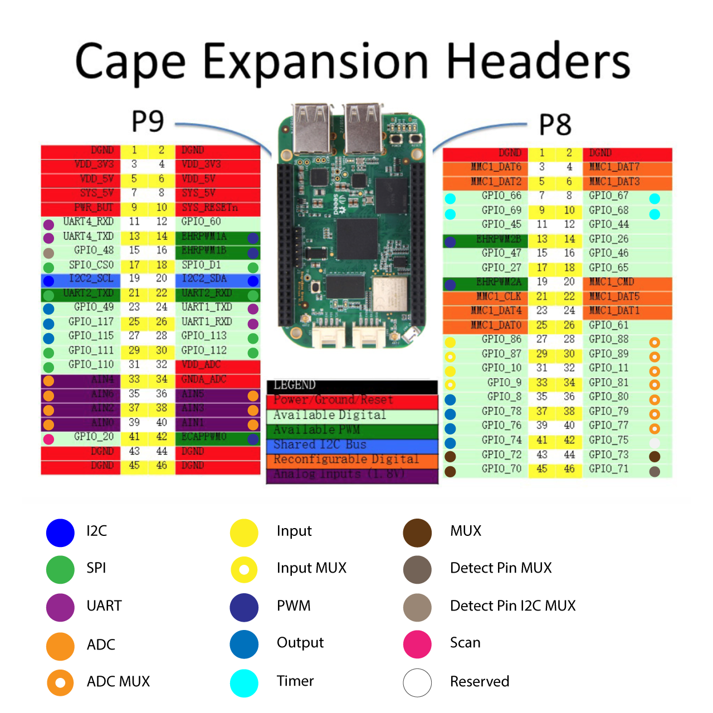

# Firmware DOCS

This documentation provides a *schematic* overview of the Firmware. For a more in-depth view of the individual modules please have a look at the *inline* documentation in the files.

## Content

* `Drivers`, `Manuals`, `Scripts` and the `README.md` contain everything needed to install the Firmware
* `Reports`, `DOCS.md` and `API.md` contain the documentation of the Firmware
* `Example` contains sample code to interface the **API**
* `Logs` contains a set of files generated at runtime
* `src` contains the source code of the Firmware

## Hardware Layout



## Setup & Installation

Look at `README.md` for instructions to setup and installation.

## Example

The `api.py` in `Example` is a simple interface tool listening to the broadcast of the Firmware sent to a computer. Therefore this script needs to run on a different computer than the BBGW while listening to the TCP/IP connection and logging an overview to the console.

Copy the file to your computer, install python and run the scripts:
```
python api.py
```

## Source

`requirements.txt` holds the necessary libraries in order to run the Firmware.

*(The Adafruit library used to interface the hardware cannot be installed with pip. More information in the `README.md`)*

### Main.py

The main file is the heart of the Firmware and used to start it with:

```
sudo python3 Main.py [ldmepf]
```

* *`sudo` is needed due to the 'PWM Module', which needs root access*
* *Have a look at `README.md` for more information about `[ldmepf]` flags*

#### Initialization

The initialization imports all necessary modules and initializes at default state. It creates the TCP/IP socket for the connection, launches 3 threads described below and idles until the Firmware is terminated with or a fatal error is thrown.

#### Update Thread

The *update* thread is executed every `UPDATE_PERIODE`. It has following tasks:

1. Collecting the newly read values for the devices and sending a `D` message.
2. Receiving `DeviceList` messages and sending `Register` messages for all connected devices
3. Receiving `Set`, `Settings` messages and set new values or change settings for devices
4. Receiving `Scan` and `Ping` messages to enabling/disabling scanning or pinging back

#### Scan Thread

The *scan* thread is executed every `SCAN_PERIODE`. It has following tasks:

1. Collecting the newly connected or disconnected devices and sending `Register` or `Deregister` messages
2. MUX devices are handled differently and are not directly exposed

#### Print Thread

The *print* thread is executed every `PRINT_PERIODE`. It has following tasks:

1. Send the 'CycleDuration' message containing the durations to execute the *update* and *scan* threads
2. Logging the current devices, its values and read timings to the console

### CommunicationModule.py

The communication module handles all data traffic of the Firmware. Internally a TCP/IP socket is held open to send and receive serialized JSON messages. The messages are internally queued and one can use the non-blocking *send* and *get* methods to push and pop messages.

*The Communication Module can be executed as script for debugging purposes leading to a TCP/IP connection constantly pinging on the opened channel.*

### Config.py

The configuration of the hardware layout is defined by assigning Pins and Channels to different type of possible devices. For example the I2C addresses used by the implemented drivers are registered and unique device configurations are defined. **CAREFUL:** Each pin and channel has to be assigned at most one time.

#### Configurations

* MUX
  * A, B, C: 'PIN_XX'
  * DETECT: 'PIN_XX' | True | False
* INPUT
  * DATA: 'PIN_XX'
  * MUX: 'PIN_XX' | None
* OUTPUT
  * DATA: 'PIN_XX'
* PWM
* DATA: 'PIN_XX'
* ADC
  * DATA: 'PIN_XX'
  * MUX: 'PIN_XX' | None
* I2C
  * ADDRESS: ADDRESS_XX
  * BUSNUM: 1 | 2

### (XXX)Module.py

The (MUX|ADC|I2C|Input|Output|PWM) modules provide following functionality:

* Scan for devices, detect newly added and disconnected devices and update the internal state. If a channel/pin is MUXed, the MuxModule is used to switch the channels.
* MUX excluded
  * Read values of a devices identified by name and return the new values since the last read.
  * Change settings of a device identified by name if it is allowed.
* MUX only
  * Check if MUXing is globally enabled.
  * List connected MUXes for different device types.
  * Activate/Deactivate a MUXed channel of a device identified by name. (This method has a *semaphore* and one need to minimize the time between activation and deactivation)

### (Mux)Drivers

Drivers are modules dedicated to a unique type of devices. They are able to interface devices of their type and scanning, updating and configuring at runtime. The drivers are registered in the appropriate (XXX)Modules where they are managed. Each driver has a dedicated thread internally allowing the threads to run different velocities depending on the type of device. For device types like ADC, Input, Output and PWM a single driver is usually enough but for I2C devices, which need to be interfaced individually, there is a template `I2C_DRIVER_TEMPLATE.py` for a driver provided which can be used to implement drivers for new device types according to the instructions in `__IMPLEMENT_NEW_DRIVER.md`.

MUX drivers are bit special as there is only one driver allowed at the time. But you are free to add as many I2C MUX drivers on *different* addresses as you like.


### Embedded loop

Embedded loops are custom made controllers that use the same api as on a connected computer application. It is run with the `f` command.

### SPI

Date: December 2020

SPI is now added to list of features of this product. The availbale pins for configuring SPI pins are shown bellow:


Initially pins are not configured as SPI and it should either be done manually everytime the system is booted up or permanently. The two possible options are explained in the following sections.

#### Manually

#### Permanently

#### Template for Creating new Driver

`_SPI_DRIVER_TEMPLATE.py` is provided to follow the instruction to create new template for new sensors. 